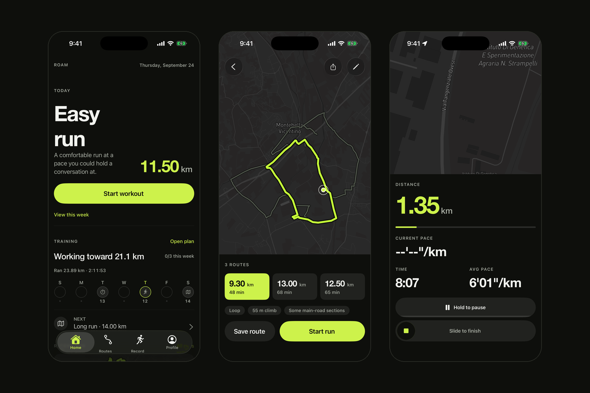
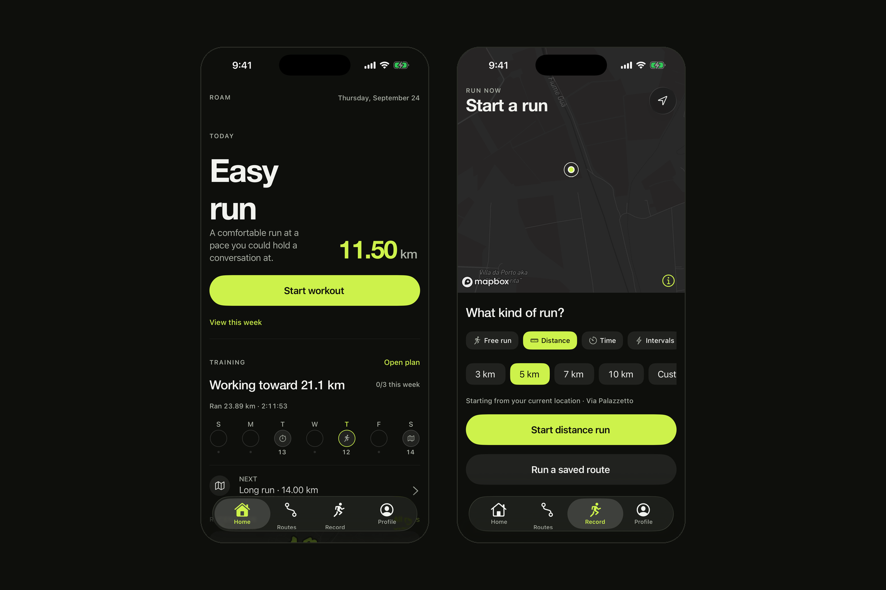
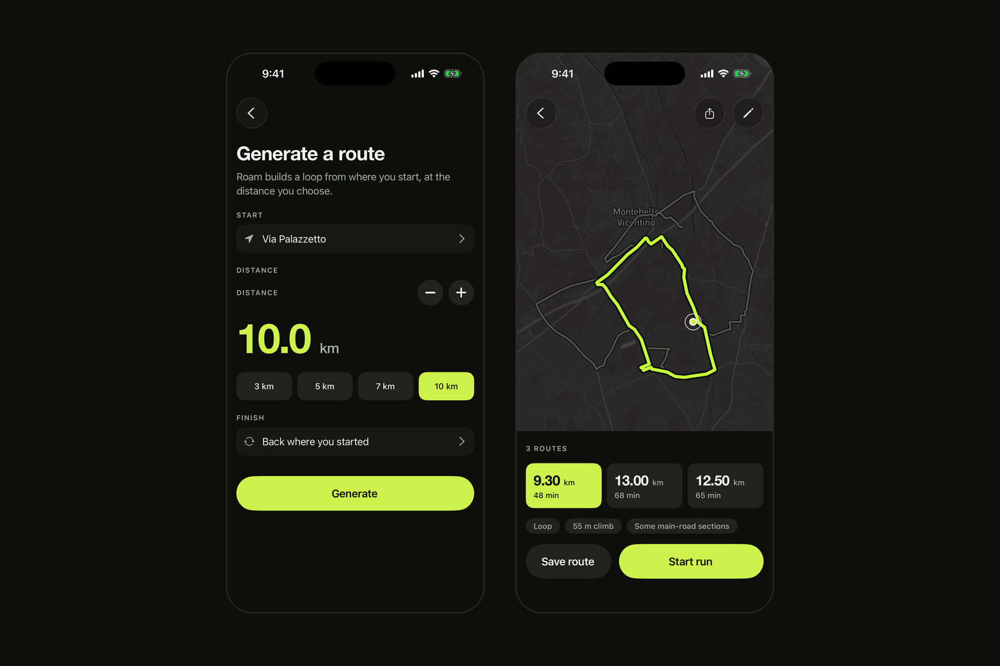
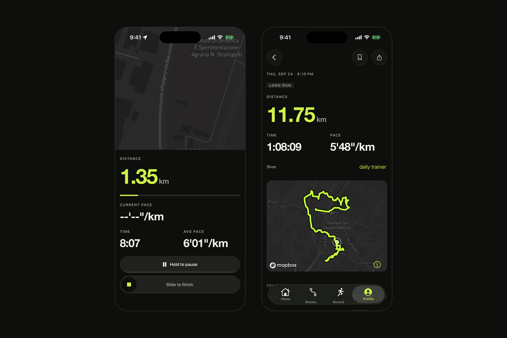
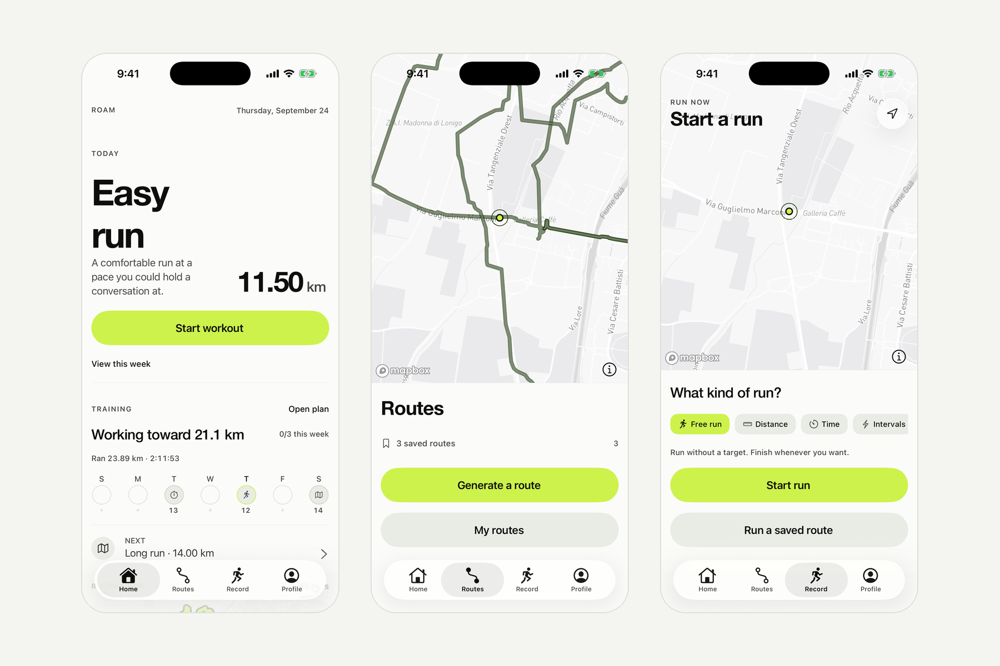

<div align="center">

# ROAM

**A running app for people who know the distance, but not the route.**

Pick how far you want to run. Roam builds a runnable loop from where you are, then tracks and records the run — entirely on your phone.

`Expo` · `React Native` · `TypeScript` · `Mapbox` · `OpenRouteService`

**Beta — actively in development.** A working prototype moving toward production.



</div>

---

## What it does

- **Route discovery** — choose a distance and get real loops, ranked for coherent shape, major-road exposure and elevation.
- **Running** — a pure, tested GPS tracker with auto-pause, splits, off-route warnings and personal records, all derived from real data only.
- **Training** — deterministic plans shaped from your own runs and the days you can actually run.
- **Local-first** — one JSON file per run or route; an interrupted run resumes. No account, no backend required.

## Screens

| Home | Routes | Active run |
| :--: | :----: | :--------: |
|  |  |  |



## Stack

| | |
| --- | --- |
| App | Expo SDK 57 · React Native · TypeScript (strict) · expo-router |
| Maps & routing | Mapbox (`@rnmapbox/maps`) · OpenRouteService, behind a small proxy |
| Storage | `expo-file-system` — offline-first, no database, no backend |
| Quality | Jest (`jest-expo`) · GitHub Actions CI: type-check, lint and tests on every push |

## How it's built

Documentation-first and issue-driven: each feature starts as a design note or a decision record, ships as a small scoped change on a short-lived branch, and lands through a pull request with conventional commits.

## Running it

```bash
npm install
cp .env.local.example .env.local   # add a Mapbox token and an OpenRouteService key
npx expo run:ios                    # a development build; Expo Go is not supported
```

## Status

Beta. The routing provider, GPS permissions and connectivity still need production QA, and route-shape quality is being refined across loops, out-and-backs and real street constraints.

---

Designed and built by **Mattia Zeminian**.
